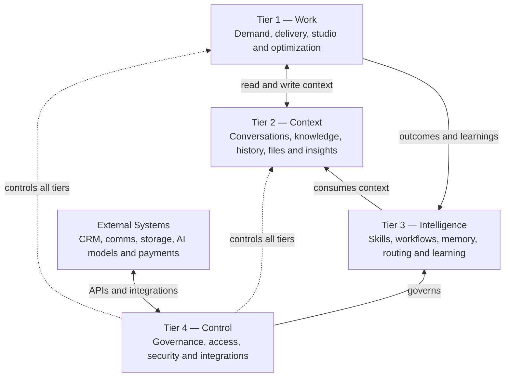
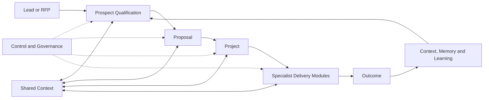

# enque.ai — Website and Product Flow

## 1. Purpose

enque.ai is **The Digital Workforce for Agency that Never Sleeps**: one modular platform that connects agency execution, shared context, operational intelligence, and governance.

The website should explain the platform from the visitor's point of view first, then progressively reveal the underlying system. A visitor should understand:

1. What enque.ai is.
2. Who it is for.
3. What work it helps an agency perform.
4. How the four tiers work together.
5. Which modules exist today and which are coming next.
6. How to request a demo or begin a conversation.

---

## 2. Core Positioning

### Primary message

**The Digital Workforce for Agency that Never Sleeps**

Plan, execute, govern, and improve every kind of agency work from one expandable orchestration platform.

### Supporting message

enque.ai combines work tools, organizational context, AI-driven operations, and platform controls in one system. Agencies can start with the core modules and add specialized tools without rebuilding the foundation underneath.

### Main value pillars

- **One workspace:** Manage demand, delivery, production, and optimization work.
- **Shared context:** Give every module access to the same conversations, knowledge, histories, files, and insights.
- **Governed intelligence:** Use skills, workflows, memory, routing, reasoning, and evaluation to turn context into action.
- **Central control:** Apply roles, security, administration, auditability, and integrations across the platform.
- **Expandable by design:** Add new work modules without changing the shared orchestration foundation.

---

## 3. Recommended Website Sitemap

```text
Home
├── Platform
│   ├── System Overview
│   ├── Tier 1 — Work
│   ├── Tier 2 — Context
│   ├── Tier 3 — Intelligence
│   └── Tier 4 — Control
├── Modules
│   ├── Demand
│   ├── Delivery
│   ├── Studio
│   └── Optimize
├── How It Works
├── Build Status / Roadmap
├── About
└── Request a Demo
```

For an initial single-page launch, these can be page sections rather than separate routes.

---

## 4. Homepage Flow

### Section 1 — Hero

**Goal:** Establish the category and value immediately.

- Logo and enque.ai wordmark.
- Headline: **The Digital Workforce for Agency that Never Sleeps**.
- Supporting copy focused on one platform for work, context, intelligence, and control.
- Primary CTA: **Request a Demo**.
- Secondary CTA: **Explore the Platform**.
- Visual: a simplified animated view of the four tiers working as one system.

### Section 2 — The Agency Problem

**Goal:** Make the need for orchestration clear.

- Agency work is spread across disconnected tools.
- Context is fragmented across conversations, files, people, and projects.
- Automation without governance becomes difficult to trust or scale.
- Teams repeatedly recreate knowledge and operating processes.

Transition message: **enque.ai brings the whole agency system into one governed operating model.**

### Section 3 — The Whole System in One Map

**Goal:** Introduce the architecture without overwhelming the visitor.

Show the system as four connected tiers:

1. **Work** — where agency value is created.
2. **Context** — what the system knows.
3. **Intelligence** — how the system decides, acts, and improves.
4. **Control** — how everything is governed.

Cross-cutting guarantees should appear alongside the tiers:

- Role-based access control.
- Security and compliance.
- Audit logs.
- Scalable architecture.
- APIs and integrations.

### Section 4 — Tier 1: Work

**Goal:** Lead with recognizable agency outcomes.

Group the expandable work modules into four families:

| Family | Purpose | Modules |
|---|---|---|
| Demand | Find, qualify, and win work | RFP & Tenders, Prospects |
| Delivery | Scope and deliver client work | Proposals, Projects |
| Studio | Plan and produce creative work | Content, Media, Production Studio |
| Optimize | Improve performance and growth | Marketplace, Performance Marketing, Ads |

Additional expandable modules may include Social Media, SEO & Content, Web Development/Experience, CRM & Lifecycle, Audits, and other agency-specific tools.

Core execution flow:

```text
Prospects → Proposals → Projects → Outcomes
```

Each module can use shared context and platform intelligence while remaining independently expandable.

### Section 5 — Tier 2: Context

**Goal:** Explain how every work module stays informed.

The Context Layer is the shared contextual foundation for the entire platform:

- Communication Hub / Conversation Hub.
- Knowledge Base / Second Brain.
- Client History.
- Project History.
- Files & Data.
- Search & Insights.

Context flow:

```text
People + Conversations + Documents + Decisions + Work History
                              ↓
                    Shared Context Layer
                              ↓
                  Every Work and AI Module
```

Work modules continuously read from and write back to this shared context.

### Section 6 — Tier 3: Intelligence

**Goal:** Show how enque.ai turns information into governed action.

The Operational Intelligence layer provides reusable capabilities across all modules:

- Skills.
- Workflows.
- Memory.
- Agent & Module Routing.
- Reasoning & Planning.
- Evaluation & Learning.

Intelligence flow:

```text
Context → Select Skills → Route Agent/Module → Run Workflow → Produce Outcome
   ↑                                                               ↓
   └──────────── Memory + Evaluation + Learning ───────────────────┘
```

This layer determines who or what should do the work, which capabilities are needed, how steps are orchestrated, and how outcomes improve future execution.

### Section 7 — Tier 4: Control

**Goal:** Build confidence that AI and automation remain governed.

The Control Panel applies across every tier, module, agent, and action:

- Roles & Permissions.
- Agency Admin.
- APIs & Integrations.
- Platform Admin.
- Security & Isolation.
- Audit Logs.

It also connects enque.ai with external systems such as CRM, communications, storage, AI models, payments, and other agency tools.

### Section 8 — The Orchestration Loop

**Goal:** Bring the four tiers back together as one continuous system.



Plain-language loop:

```text
Control → Intelligence → Context → Execution → Outcomes
   ↑                                             ↓
   └────────────── Learning and governance ──────┘
```

### Section 9 — Modular by Design

**Goal:** Show that enque.ai can grow with each agency.

- Begin with core modules.
- Add specialist work modules as needs evolve.
- Reuse the same shared context and intelligence services.
- Keep permissions, security, and auditability consistent.
- Connect external tools through the common integration layer.

Key message: **New tools can be added without changing the system underneath.**

### Section 10 — Build Status

**Goal:** Communicate product maturity transparently.

Status key:

- **Built** — available core capability.
- **Under Development** — actively being developed.
- **To Be Built** — planned/expandable capability.

| Tier | Built | Under Development | To Be Built / Expandable |
|---|---|---|---|
| Work | Proposals, Projects | Prospects | Production Studio, Marketplace, Performance Marketing, Audits, RFP, Content, Media, Web Development, and other modules |
| Context | — | Knowledge Base, Communication Hub, Client History, Project History, Files & Data, Search & Insights | Future context extensions as required |
| Intelligence | Skills, Workflows, Memory | Agent & Module Routing | Evaluation & Learning, Reasoning & Planning |
| Control | Roles & Permissions, Agency Admin, APIs & Integrations | — | Platform Admin, Security & Isolation, Audit Logs |

The website should keep this section data-driven so statuses can change without redesigning the page.

### Section 11 — Final CTA

**Goal:** Convert interest into a qualified conversation.

- Headline: **Run your agency as one intelligent system.**
- Primary CTA: **Request a Demo**.
- Optional secondary CTA: **Talk to the Team**.
- Short form fields: name, work email, agency/company, team size, and primary use case.

---

## 5. Product Interaction Flow

A typical end-to-end workflow should be explained as follows:

1. A lead, tender, or opportunity enters **Prospects/RFP**.
2. The system uses client history, knowledge, files, and conversations from **Context**.
3. **Skills, routing, and workflows** qualify the opportunity and coordinate the next action.
4. A winning response is prepared and managed in **Proposals**.
5. Approved work becomes a **Project**.
6. Studio or optimization modules perform specialist delivery work.
7. Roles, permissions, security, and integrations govern every action through **Control**.
8. Outcomes, decisions, and lessons return to **Context and Memory**.
9. Evaluation and learning improve future planning and execution.



---

## 6. Primary Visitor Journeys

### Agency leader

```text
Homepage → Platform Overview → Business Outcomes → Build Status → Request a Demo
```

Questions answered: Can this unify our agency? Is it modular? Is it governed? What is available now?

### Operations leader

```text
Homepage → How It Works → Context + Intelligence → Workflows and Integrations → Request a Demo
```

Questions answered: How does work move through the system? How is knowledge reused? Can it integrate with our current stack?

### Delivery team member

```text
Homepage → Work Modules → Relevant Module Family → Shared Context → Request a Demo
```

Questions answered: What daily work can I do? How does the system reduce handoffs and duplicated effort?

### Technical or security evaluator

```text
Homepage → System Overview → Control → Security and Isolation → APIs and Integrations → Contact
```

Questions answered: How is access controlled? How are actions audited? How does the platform connect to external systems?

---

## 7. Content and Design Rules

- Always introduce the platform through outcomes before technical architecture.
- Use the same four tier names consistently: **Work, Context, Intelligence, Control**.
- Treat “Guarantees” as properties spanning all tiers, not as another group of work modules.
- Clearly separate current capabilities from roadmap items.
- Use color consistently by tier and never use build-status colors as tier colors.
- Keep detailed module features behind expandable cards, tabs, or dedicated pages.
- Show directional flow: Control governs, Intelligence orchestrates, Context informs, and Work produces outcomes.
- Avoid presenting enque.ai as a loose collection of AI tools; the differentiator is unified orchestration.
- End every major exploration path with a clear demo/contact action.

---

## 8. One-Sentence Summary

**enque.ai is a modular, governed digital workforce that connects agency work to shared context and reusable intelligence, then learns from every outcome.**
